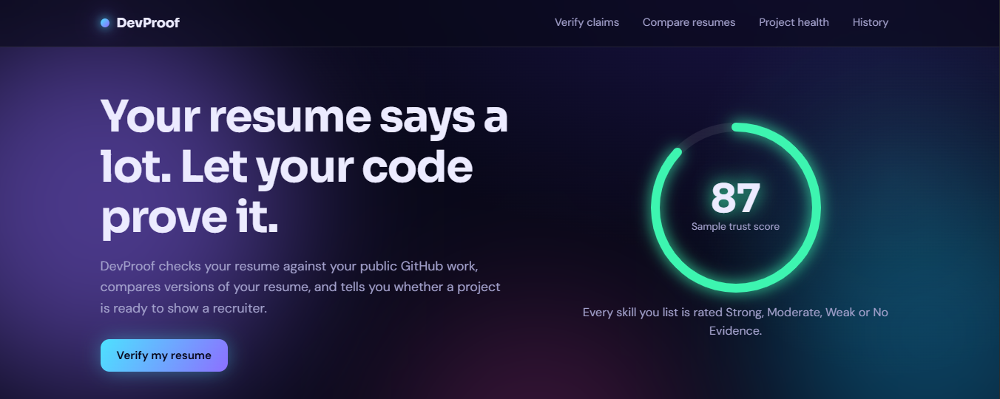
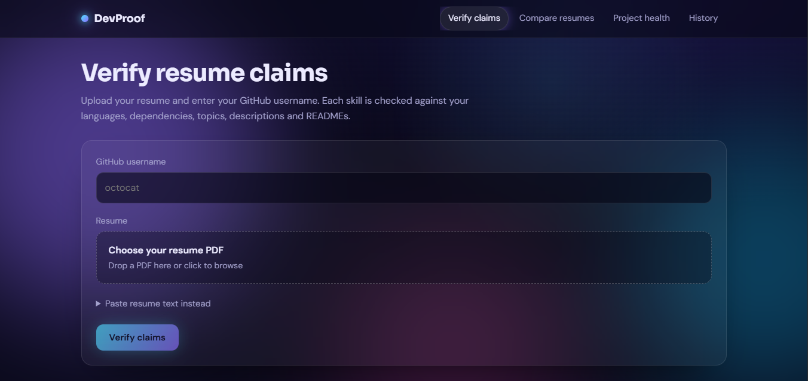
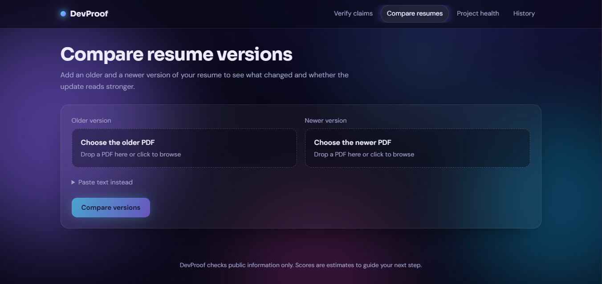
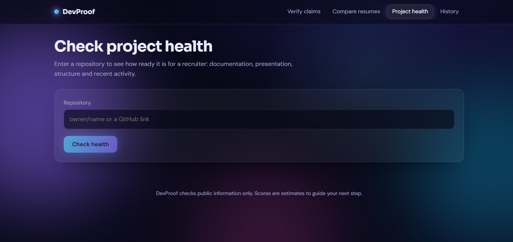
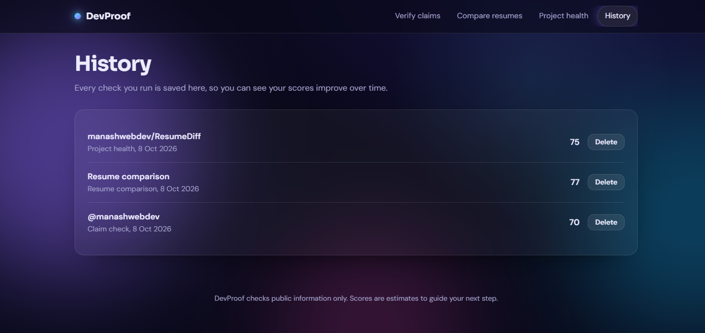

# DevProof

### Verify. Compare. Prove.

DevProof is a full-stack developer credibility platform that helps developers verify resume claims against their public GitHub work, compare resume versions, and analyze the health of GitHub projects.

Instead of relying only on self-reported skills, DevProof connects resume claims with real project evidence.

## 🚀 Live Demo

**Live App:** https://devproof-eight.vercel.app/

**Backend API:** https://devproof-e4fk.onrender.com/

## 📸 Screenshots

### Dashboard



### Verify Resume Claims



### Resume Diff



### GitHub Projecdevproof-th



### Analysis History



## ✨ Features

### 🔍 Verify Resume Claims

Upload a resume and provide a GitHub username.

DevProof analyzes the skills mentioned in the resume against the developer's public GitHub projects and activity.

Each claim receives an evidence level:

* 🟢 Strong
* 🟡 Moderate
* 🟠 Weak
* 🔴 No Evidence

A Trust Score summarizes how well the resume claims are supported by available GitHub evidence.

### 📄 Resume Diff

Compare two versions of a resume and identify:

* Skills added
* Skills removed
* Changed content
* Resume differences
* Which version appears stronger

Useful for tracking how a resume evolves over time.

### 🩺 GitHub Project Health

Enter a GitHub repository and DevProof analyzes its documentation and presentation quality.

It checks areas such as:

* README quality
* Documentation
* Project structure
* Repository presentation
* Activity
* Missing sections
* Portfolio readiness

The result includes a project health score and prioritized improvements.

### 🕒 History

DevProof can save previous analysis results using MongoDB.

Users can review and delete previous:

* Resume verification results
* Resume comparisons
* Project health analyses

## 🧠 Why DevProof?

A developer can claim:

> "I know React, Node.js, MongoDB and TypeScript."

But a resume claim becomes more meaningful when there is actual evidence behind it.

DevProof bridges the gap between:

**What a developer claims → What their public work demonstrates**

It helps developers identify unsupported claims and improve how they present their skills and projects.

## 🛠️ Tech Stack

### Frontend

* React
* Vite
* Tailwind CSS
* Framer Motion
* JavaScript

### Backend

* Node.js
* Express.js
* Multer
* PDF Parse
* REST API

### Database

* MongoDB
* Mongoose

### Integrations

* GitHub API

### Deployment

* Vercel — Frontend
* Render — Backend
* MongoDB Atlas — Database

## 🏗️ Architecture

```text
                    ┌─────────────────────┐
                    │        User         │
                    └──────────┬──────────┘
                               │
                               ▼
                    ┌─────────────────────┐
                    │    React + Vite     │
                    │       Vercel        │
                    └──────────┬──────────┘
                               │
                            REST API
                               │
                               ▼
                    ┌─────────────────────┐
                    │  Node.js + Express  │
                    │       Render        │
                    └──────┬────────┬─────┘
                           │        │
                  ┌────────┘        └─────────┐
                  ▼                            ▼
          ┌───────────────┐           ┌────────────────┐
          │ MongoDB Atlas │           │   GitHub API   │
          └───────────────┘           └────────────────┘
```

## 📁 Project Structure

```text
DevProof/
│
├── client/
│   ├── src/
│   ├── public/
│   ├── package.json
│   └── ...
│
├── server/
│   ├── src/
│   │   ├── services/
│   │   │   ├── skills.service.js
│   │   │   ├── github.service.js
│   │   │   ├── verify.service.js
│   │   │   ├── diff.service.js
│   │   │   └── health.service.js
│   │   ├── ...
│   │   └── index.js
│   ├── package.json
│   └── ...
│
├── docs/
│   └── screenshots/
│
├── package.json
└── README.md
```

## ⚙️ Local Setup

### Requirements

* Node.js 18+
* npm

### 1. Clone the repository

```bash
git clone https://github.com/manashwebdev/DevProof.git
cd DevProof
```

### 2. Install dependencies

```bash
npm run install:all
```

### 3. Configure environment variables

Create:

```text
server/.env
```

Add:

```env
GITHUB_TOKEN=your_github_token
MONGODB_URI=your_mongodb_connection_string
```

Both variables are optional.

Without `MONGODB_URI`, History is disabled.

Without `GITHUB_TOKEN`, DevProof can still use the GitHub API, but the API rate limit is lower.

### 4. Start development servers

```bash
npm run dev
```

Frontend:

```text
http://localhost:5173
```

Backend:

```text
http://localhost:5000
```

### 5. Check API status

Open:

```text
http://localhost:5000/api/status
```

Expected response when both integrations are configured:

```json
{
  "ok": true,
  "db": true,
  "github": true
}
```

## 🔌 API Endpoints

### Verify Resume Claims

```http
POST /api/verify
```

Accepts:

* Resume PDF
* Resume text
* GitHub username

### Compare Resumes

```http
POST /api/diff
```

Accepts:

* Before resume
* After resume

Both PDF and text input are supported.

### Analyze Project Health

```http
POST /api/health
```

Request:

```json
{
  "repo": "owner/repository"
}
```

### History

```http
GET /api/history
```

```http
DELETE /api/history/:id
```

### API Status

```http
GET /api/status
```

## 🔐 Environment Variables

| Variable       | Required | Purpose                         |
| -------------- | -------- | ------------------------------- |
| `GITHUB_TOKEN` | No       | Increases GitHub API rate limit |
| `MONGODB_URI`  | No       | Enables analysis history        |

Never commit `.env` files or expose server secrets in the frontend.

## 🚀 Production

Build the frontend:

```bash
npm run build
```

Start the production server:

```bash
npm start
```

The Express server serves the built frontend from:

```text
client/dist
```

## 🎯 Use Cases

DevProof can be useful for:

* Students building developer portfolios
* Junior developers applying for internships
* Freelancers improving their credibility
* Developers preparing resumes
* Developers auditing GitHub repositories
* Developers aligning their resumes with their actual work

## 🔮 Future Improvements

* More advanced GitHub evidence matching
* Improved skill detection
* Deeper repository analysis
* Shareable verification reports
* PDF report generation
* More detailed project recommendations
* Authentication and user profiles
* Advanced analytics

## 👨‍💻 Author

**Manash Khati**

Full Stack Developer focused on building practical web applications and developer tools.

**GitHub:** https://github.com/manashwebdev

**Portfolio:** https://manash-dev-portfolio.netlify.app/

## 📄 License

This project is available for educational and portfolio purposes.
